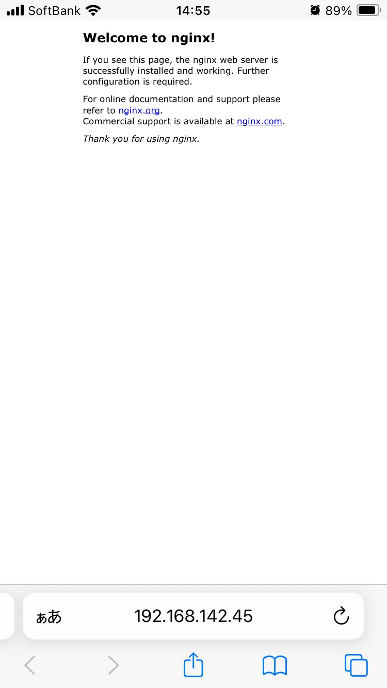

# お題
PCのDockerで起動したWebサーバーにスマホのブラウザでアクセスしてみましょう。


# (1)nginxのdocker imageの資料を見てnginxのdockerコンテナを起動するnginxの
docker hubに記載されている`How to use this image`を参考にする。<br>
https://hub.docker.com/_/nginx

### (1-1)Dockerfileとstatic-html-directoryディレクトリを作成する。
以下のような構造になるように作成する。
```
.
├── Dockerfile
└── static-html-directory
```

### (1-2)Dockerfileを記述
```
FROM nginx
COPY ../static-html-directory /usr/share/nginx/html
```

### (1-3)buildのコマンドを実行
`docker build -t some-content-nginx .`

### (1-4)dockerコンテナを動かす
some-nginxという名前でnginxコンテナを起動する。<br>
8080をコンテナの80万ポートにマッピングする<br>
`docker run --name some-nginx -d -p 8080:80 some-content-nginx`

### (1-5)PCのブラウザでhttp://localhost:8080を開く
`http://localhost:8080`<br>
nginxが立ち上がっていることを確認

# (2)ifconfigで自分のPCのIPを確認する
`ifconfig`<br>
※en0のところに書いてあるIPアドレスを確認する。<br>

今回は`192.168.142.45`でした。

# (3)スマホをPCと同じwifiに接続し、PCのIPと8080ポートにアクセスする。

`192.168.142.45:8080`

## (8)表示される



