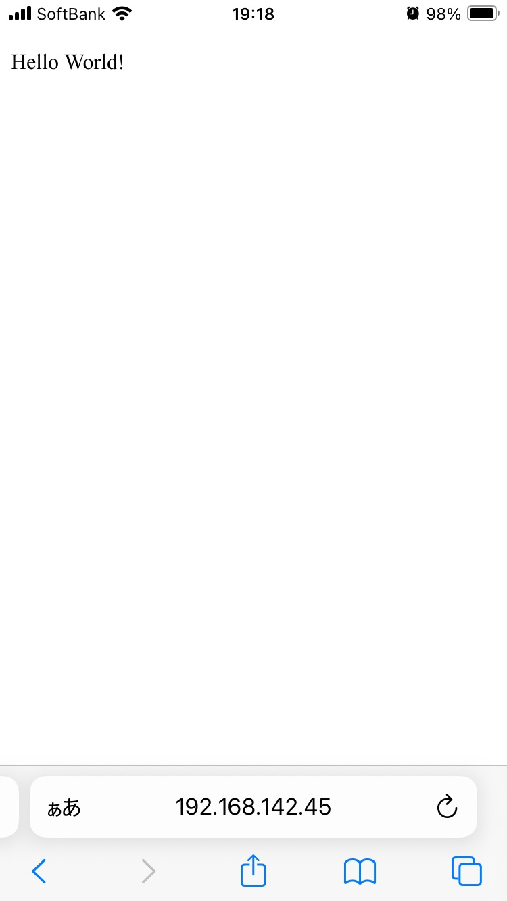

# お題
https://engineer-blog.ajike.co.jp/php-builtin-server/
を参考にして、<br>
php -S コマンドでPCにサーバーを起動して、<br>
宿題と同じ様にスマホからアクセスしてみてください。<br>
アクセス出来たら、宿題と同様にスクリーンショットと手順書を送ってください。


# 回答

## 1. 準備

### 1-a. phpがインストールされているかを確認する
`php -v`
<br>
私のバージョン
<br>
```
PHP 8.3.11 (cli) (built: Aug 27 2024 19:16:34) (NTS)
Copyright (c) The PHP Group
Zend Engine v4.3.11, Copyright (c) Zend Technologies
    with Zend OPcache v8.3.11, Copyright (c), by Zend Technologies
```

### 1-b. phpが立ち上がっているかを確認する
`brew services list`
<br>
```
Name          Status User File
mysql@5.7     none        
php           none        
php@7.4       none        
php@8.0       none        
postgresql@14 none  
```

### 1-c. 立ち上がっていなかったのでphpを起動する
`brew services start php`
<br>
立ち上がると下のようなメッセージが表示される。
```
==> Successfully started `php` (label: homebrew.mxcl.php)
```

### 1-d. index.phpファイルを作成する
index.phpファイルを作成します。
<br>
現在、以下のようなディレクトリ構成になっています。

```
.
├── README.md
└── index.php

```
例えば下のようにindex.phpファイルに記述します。

```
<!DOCTYPE html>
<html lang="en">
<head>
  <meta charset="UTF-8">
  <meta name="viewport" content="width=device-width, initial-scale=1.0">
  <title>hello</title>
</head>
<body>
  <p>Hello World!</p>
</body>
</html>
```

### 1-e. IPアドレスを確認する
`ifconfig`
<br>
`192.168.142.45`でした。

## 2. ビルトインサーバーを立ち上げてスマホでアクセスする

### 2-a. コマンドを実行してビルトインサーバーを立ち上げる
`php -S 0.0.0.0:8000`
<br>
※↑の記事では`localhost`で起動しているが、`localhost`や`127.0.0.1`は<a href="https://livra.geolocation.co.jp/iplearning/217/" target="_blank" rel="noopener noreferrer">ループバックアドレス</a>になるため、他のコンピュータとの通信には使えない。

### 2-b. PCのブラウザでlocalhost:8000にアクセスする
`localhost:8000`
<br>
立ち上がっていることを確認します。

### 2-c. スマホのブラウザで192.168.142.45:8000にアクセスする
表示されました。
<br>



